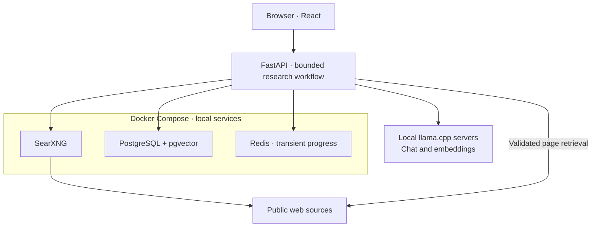

# Pensae Signal

**Find product opportunities in real, documented problems.**

Pensae Signal is a local research application that searches public sources, identifies recurring
problems, and develops evidence-backed product opportunities. It combines local language models
with a bounded research workflow and a persistent portfolio for reviewing what to pursue next.

Anyone may download and use the code under the **[Apache License 2.0](LICENSE)**. The project is
shared for demonstration and education. **External contributions and pull requests are not
accepted.**

The core principle is simple: **model output is analysis; source text is evidence.** Retained
excerpts are constructed and checked mechanically against retrieved text.

[Features](#features) · [Installation](#installation) · [Usage](#usage) ·
[Configuration](#configuration) · [Tests](#tests) · [Reference](#reference) ·
[Project policy](#project-policy)

> **Project status:** a single-operator local prototype for native Fedora 44. The application,
> browser, and model servers run on the same workstation. Public search and source retrieval use
> the internet; model inference runs locally. Services bind to IPv4 loopback and have no
> authentication or remote-access mode. Keep them local.

## Features

- **Research from a chosen focus.** Discover public signals, group problems, identify affected
  users and buyers, and evaluate possible product opportunities.
- **Evidence you can inspect.** Review source links and mechanically verified excerpts alongside
  the analysis, scores, verdict, and limitations.
- **A target of five distinct opportunities.** A run aims to retain five qualifying opportunities
  when sufficient evidence exists. Shortfalls are reported explicitly instead of filled with
  unsupported results.
- **Bounded execution.** Follow live progress, work and token usage, remaining capacity, and the
  reason a run completed or stopped. Only one research run can be active.
- **Incremental saving.** Each complete opportunity commits independently. Earlier results survive
  a later failure or a cooperative stop; incomplete research is not resumed after a restart.
- **A portfolio that preserves context.** Inspect versions and related opportunities, confirm
  possible rediscoveries, and merge records manually with a reversible, non-destructive operation.
- **Local operational control.** Check dependency readiness, back up the database, and use a
  launcher that reuses compatible model servers and stops only processes it owns.

## How it works



The native application and model servers run outside Docker. Compose manages only the three
infrastructure services, using Linux host networking with explicit loopback binds. The browser
reaches the application through one FastAPI origin.

| Layer | Technologies |
|---|---|
| Interface | React 19, TypeScript, Vite, TanStack Query |
| Backend and workflow | Python 3.13, FastAPI, Pydantic, LangGraph |
| Durable data | PostgreSQL, pgvector, SQLAlchemy, Alembic |
| Search and retrieval | SearXNG, HTTPX, Trafilatura |
| Local inference and progress | llama.cpp, Redis, server-sent events |

Accepted opportunities, evidence, settings, and lifecycle records are durable. Full pages,
extracted text, prompts, raw model output, and incomplete work are transient. See the
[security and data section](#security-and-data) for the complete boundary.

## Installation

### Prerequisites

- **Native Fedora 44 on x86-64**, with an approved NVIDIA Linux driver and sufficient GPU memory
  for the configured chat model.
- **Git, GNU Make, Python 3, curl, tar, xz, and SHA-256 utilities.**
- **uv 0.11.28** and **Docker Engine with the Compose plugin**.
- **llama.cpp build `b10076`** and the required model files, acquired separately:

  | Role | Required model |
  |---|---|
  | Chat | `Qwen3.6-35B-A3B-UD-IQ4_XS` GGUF |
  | Embeddings | `Qwen3-Embedding-0.6B` GGUF, Q8_0 |

Use a **full Git clone**, then run the commands below from its root directory. The secret scanner
requires complete history; a source ZIP or shallow clone is insufficient for that audit. Bootstrap
pins Python 3.13.14, Node.js 24.18.0, and pnpm 11.15.1. Container images are pinned in
[`compose.yaml`](compose.yaml); model acquisition is covered by the
[model policy](MODEL_REDISTRIBUTION.md).

### 1. Prepare the development tools

```bash
make bootstrap
make install-secret-scanner

# Use the repository-pinned Node.js and pnpm in this shell.
export PATH="$PWD/.tools/node-v24.18.0-linux-x64/bin:$PWD/.tools/pnpm/bin:$PATH"
pnpm --dir frontend exec playwright install chromium
```

Bootstrap installs the pinned Python, Node.js, pnpm, and locked dependencies. Chromium supplies the
browser binary required by repository checks. These setup steps download tools; they do not install
a GPU driver, llama.cpp, or model weights.

### 2. Configure this installation

```bash
make configure-secrets
```

This creates an ignored `.env` with private permissions, independent PostgreSQL and SearXNG
secrets, and a matching database connection string. It refuses to overwrite an existing file.

Edit the three installation paths in `.env` to point to your separately acquired executable and
models. The paths below are placeholders:

```dotenv
PENSAE_LLAMA_EXECUTABLE=/absolute/path/to/llama-server
PENSAE_CHAT_MODEL_PATH=/absolute/path/to/chat-model.gguf
PENSAE_EMBEDDING_MODEL_PATH=/absolute/path/to/embedding-model.gguf
```

For an **existing installation**, follow the
[existing-installation procedure](#existing-installations)
before deploying these changes. Editing a password in `.env` does not rotate an initialized
PostgreSQL database's password.

### 3. Validate and build

```bash
make check
make secrets-check
```

`make check` verifies the code and builds the frontend served by FastAPI. With the required tools
and dependencies installed, these checks run offline and need no GPU, model files, or live model
servers.

## Usage

### Start the application

```bash
make start
```

Keep this terminal open. In another terminal, from the same repository:

```bash
make status
```

Open **[http://127.0.0.1:8000](http://127.0.0.1:8000)** in a browser on the same workstation.
The UI can open with degraded dependencies, but research starts only after the complete readiness
check passes.

### Run an example investigation

1. Open **Settings**, select `directed` as the **Discovery mode**, and enter a **Research focus**,
   for example:

   > Recurring operational problems faced by small field-service businesses when scheduling jobs,
   > coordinating technicians, and following up with customers.

2. Save the settings and start a research run.
3. Follow its progress and resource usage in **Current run**.
4. Open the resulting opportunities to inspect their evidence, analysis, scores, and verdicts.
5. Review related records before confirming rediscovery or merging opportunities.

This is an example input, not a promised result. The available evidence determines how many
opportunities qualify. Stopping a run preserves completed opportunities while discarding its
incomplete work.

### Everyday commands

| Command | Purpose |
|---|---|
| `make status` | Inspect dependency readiness and launcher ownership. |
| `make stop` | Shut down the application, its owned model processes, and Compose services. |
| `make backup` | Create a validated database backup; retain five managed backups. |
| `make infra-up` / `make infra-down` | Manage only the three infrastructure services. |

Stop active research before making a backup. See [Backup and recovery](#backup-and-recovery)
for restoring data or resolving startup failures. A model server reused from another owner is
never stopped by the launcher.

## Configuration

Configuration has three layers, each with a distinct purpose:

| Layer | Location | What it controls |
|---|---|---|
| Installation | Ignored `.env`; see [`.env.example`](.env.example) | Service connections, local secrets, application port, data/log paths, and executable/model paths. Read at startup. |
| Protected policy | [`config/protected.toml`](config/protected.toml) and versioned code | Model identities, fixed launch arguments, evidence gates, scoring, security ceilings, and workflow limits. |
| Future-run preferences | **Settings** in the application | Research focus, validated service endpoints, work budgets, and log rotation. Each run captures its effective settings. |

The protected target is five qualifying opportunities. The default and maximum total-run token
budget is 1,500,000, with an 8,192-token prompt-input cap. The UI validates configurable budgets
against the work needed to complete the workflow. The complete shipped limits are in
[`config/protected.toml`](config/protected.toml).
Current research settings support the United States and English, with `broad` or `directed`
discovery modes.

Keep `.env`, credentials, real installation paths, model weights, runtime data, logs, and database
dumps out of Git. Preserve loopback binds. The application does not manage your VPN or firewall.

### Existing installations

The secret initializer preserves an existing `.env`. Before deploying changed credentials to an
initialized database, arrange a maintenance window:

1. Finish or stop active research, create a verified private backup with `make backup`, and shut
   down the application normally.
2. Generate independent PostgreSQL and SearXNG secrets locally. Add `SEARXNG_SECRET` to the private
   `.env`, keeping the current database credentials until the role password is rotated.
3. With the application stopped, start only PostgreSQL using `docker compose up -d postgres` and
   its existing data volume. Rotate the database role password through a protected interactive
   database session, such as psql's `\password` prompt.
4. Update `POSTGRES_PASSWORD` and the password in `PENSAE_POSTGRES_DSN` together in the private
   `.env`. Keep file permissions at `0600`.
5. Restart the owned services and verify database authentication and search readiness before
   resuming research. Keep the old private configuration until validation succeeds.

Changing `.env` alone does not change an existing database role's password. Never delete database
volumes to rotate credentials.

### Backup and recovery

`make backup` stores validated dumps under `.pensae/data/backups` by default. Retain an independent
private copy outside the repository. To restore, stop the application, confirm its ownership is
clear with `make status`, and choose a valid dump in that managed backup directory:

```bash
# Replace both occurrences of this example filename with the same actual managed dump name.
make restore BACKUP=pensae-YYYYMMDDTHHMMSSZ-xxxxxxxx.dump \
  CONFIRM='RESTORE pensae-YYYYMMDDTHHMMSSZ-xxxxxxxx.dump'
```

Restore creates and migrates a fresh `pensae_restore_*` database. Inspect it before changing the
database component of `PENSAE_POSTGRES_DSN` to activate it. Keep the original database until the
restored copy has been verified.

For startup failures, inspect `make status`, correct the reported dependency or path issue, and
retry. An occupied port is not proof of process ownership: resolve unknown listeners through their
actual owner, and never force-kill a process merely to free a model port.

## Security and data

This is a trusted, single-operator local application. Keep all services bound to `127.0.0.1`;
there is no authentication or supported remote deployment. Public search and source retrieval
contact external sites, while model inference runs on the local workstation.

PostgreSQL retains completed opportunities, evidence, versions, settings, and lifecycle state.
Redis carries transient progress and cancellation state. Full retrieved pages, extracted text,
prompts, raw model output, and incomplete work are transient. Operational logs use a restricted
schema that excludes research payloads and credentials. Treat database backups as private data.

Model analysis still needs human review. The five-opportunity target depends on usable evidence,
and stopped or failed incomplete work does not resume automatically. GPU capacity and search
provider availability affect what can run successfully on a particular installation.

## Tests

After the installation steps above, use the Make targets from the repository root:

| Command | Coverage |
|---|---|
| `make test` | Deterministic Python tests and frontend component tests. |
| `make check` | Formatting, lint, types, architecture, deterministic tests, frontend build, and generated API-client drift. |
| `make test-browser` | Chromium flows against a fake backend and production frontend build. |
| `make test-integration` | Disposable infrastructure, database behavior, migrations, and backup/restore checks. |
| `make secrets-check` | Offline scanning of local Git history, staged content, working files, and expanded Office archives. |
| `make release-check` | The complete ordered local automated release gate. |

Automated tests use fakes, offline fixtures, or disposable services. They do not require live models,
a GPU, or public search. Stop the normal application stack before integration or full release
checks so disposable services can use the required local ports. Real-model acceptance remains a
separate manual procedure. The published tests use source fixtures and do not depend on local
development notes or historical acceptance documents.

## Reference

| Resource | What it contains |
|---|---|
| [Product requirements](Pensae_Signal_Problem_First_Opportunity_Discovery_PRD_v2.4.docx) | The current product scope, behavior, and acceptance criteria. |
| [System design](Pensae_Signal_Problem_First_Opportunity_Discovery_System_Design_v1.5.docx) | Architecture, runtime contracts, and data flow. |
| [OpenAPI contract](openapi.json) | The backend API and generated-client source contract. |
| [Protected configuration](config/protected.toml) | Shipped models, limits, scoring, and workflow policy. |
| [Model acquisition policy](MODEL_REDISTRIBUTION.md) | Required model artifacts and their separate acquisition. |

Pensae Signal is the application; Pensae is the owning project. The lowercase `pensae` package,
environment prefixes, and related compatibility identifiers are intentional.

## Project policy

Anyone is welcome to download, explore, and use the code under the [Apache License 2.0](LICENSE).
This repository showcases the project for demonstration and education. **External contributions
and pull requests are not accepted.**

## License

The project is licensed under the **[Apache License 2.0](LICENSE)**. Anyone may download, use,
modify, and redistribute the code, including for commercial purposes, without paying a license
fee. Retain the required notices and comply with the license's other terms. Demonstration and
education describe why this repository is shared; they do not limit how the code may be used.

See [third-party notices](THIRD_PARTY_NOTICES.md) for dependency information. Model files are acquired
separately and are not included in this repository; review the
[model acquisition policy](MODEL_REDISTRIBUTION.md) and applicable upstream terms.

## Support

For local setup and troubleshooting, start with [Installation](#installation), [Usage](#usage),
and [Backup and recovery](#backup-and-recovery). Run `make status` for dependency diagnostics and
use the [reference material](#reference) to understand the implementation.

Keep any shared diagnostics free of credentials, personal paths, database dumps, and raw research
content.
